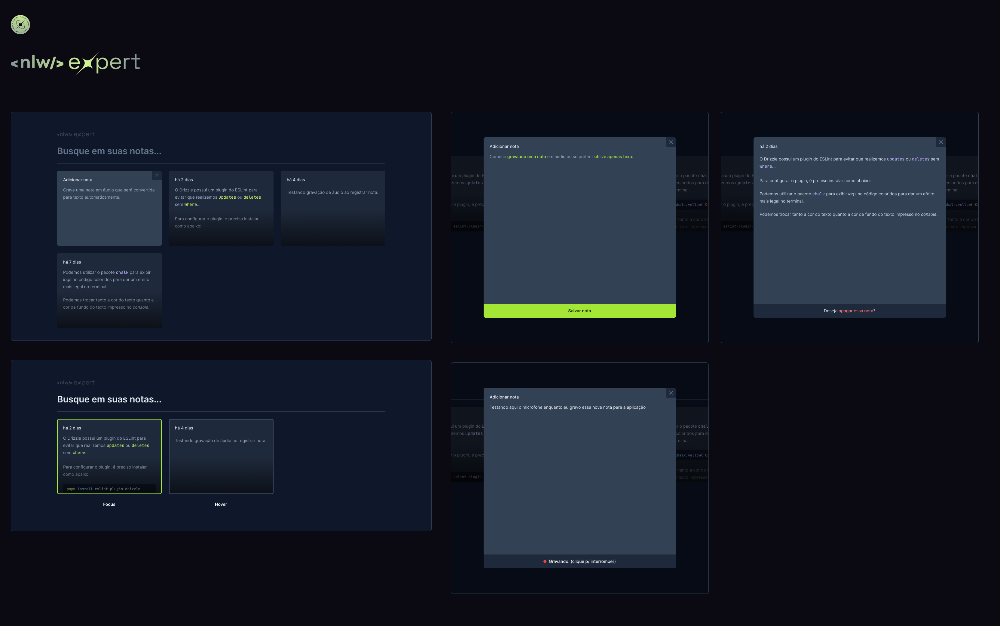

<h1 align="center">Expert Notes</h1>

Expert Notes é um aplicativo de bloco de notas desenvolvido com React e TypeScript, projetado para oferecer uma experiência intuitiva de registro de notas. Os usuários podem facilmente adicionar e gerenciar suas anotações digitando ou gravando áudio.

 

## 🚀 Funcionalidades:

- **Criar e remover uma anotação:** De forma dinâmica, os usuários podem criar ou remover suas anotações.

- **Texto da anotação digitado ou em áudio:** O conteúdo adicionado dentro da nota pode ser digitado normalmente ou inserido a partir da gravação de áudio por conta da utilização da API Speech Recognition.

- **Campo de buscas por palavras:** Busca palavras contidas dentro das anotações no histórico de notas.

## 🌐 Tecnologias:

O projeto foi desenvolvido com as seguintes tecnologias:
- React
- TypeScript
- Tailwind CSS
- API Speech Recognition
- Expo
- Vite
  
## ⚙️ Como Executar o Projeto:

- Clone este repositório em sua máquina local.
- Navegue até o diretório do projeto no terminal.
- Instale as dependências utilizando `npm install`.
- Execute o aplicativo no propmt/terminal usando `npm run dev`.
- Acesse o localhost gerado.

## 📝 Observações:
Certifique-se de ter as dependências necessárias, como Node.js e Expo, instaladas em sua máquina antes de executar o projeto.

## 🤝 Contribuições:
Contribuições são bem-vindas! Se você encontrar algum problema ou tiver alguma sugestão de melhoria, sinta-se à vontade para abrir uma issue ou enviar um pull request.

## 📜 Licença:
Este projeto está licenciado sob a MIT License - consulte o arquivo `LICENSE.md` para obter detalhes.

----
👩‍💻 by [Esthefany-Dev](https://github.com/Esthefany-Dev)
